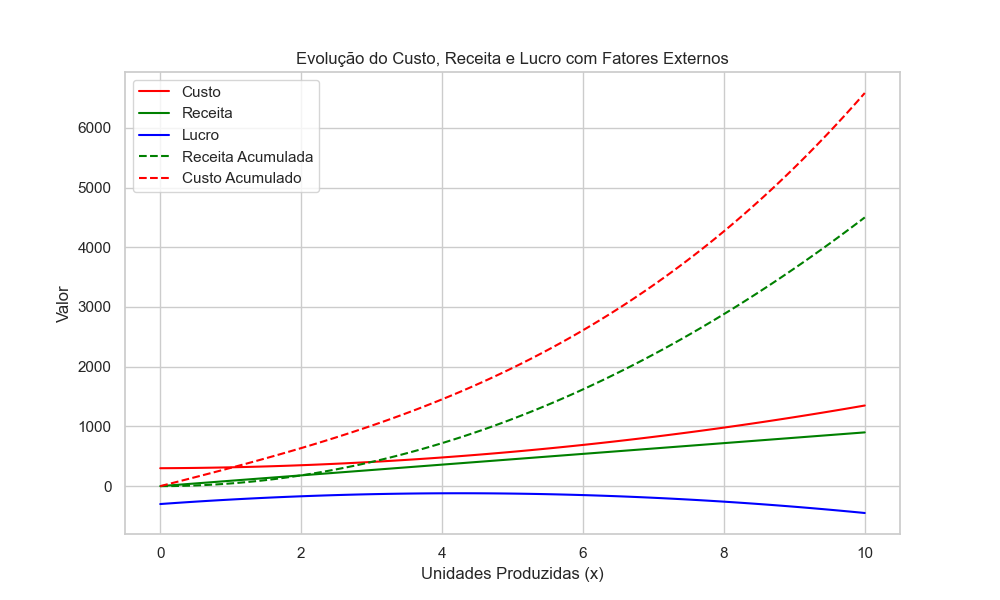

# Evolução do Custo, Receita e Lucro

Este projeto visualiza a evolução do custo, receita e lucro de uma empresa em função do número de unidades produzidas, considerando um fator externo `a` (ex. imposto).

## Funções:

- **Custo**: 
   ```text
   Custo(x) = 300 + 10 * x² + a * x
   ```
- **Receita**: 
   ```text
   Receita(x) = 90 * x
   ```
- **Lucro**: 
   ```text
   Lucro(x) = Receita(x) - Custo(x)
   ```
- **Acumulados**: Receita e custo acumulados ao longo das unidades produzidas.

## Gráfico

O gráfico mostra o custo, receita e lucro para 0 a 10 unidades produzidas, além dos valores acumulados.



## Como Executar

1. Instale as bibliotecas:
   ```bash
   pip install numpy matplotlib seaborn
   ```
2. Execute o script para gerar o gráfico.

